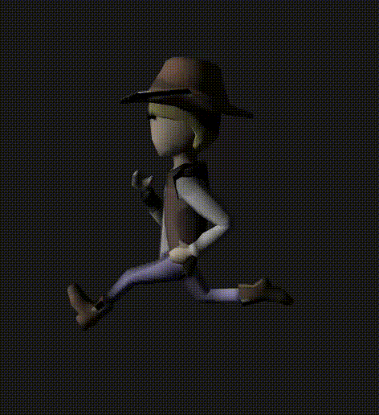

# Sceletal Animation

This is another mini project targeting computer graphics. Here I tried to implement algorithm
simulating sceletal animation. Based on animation saved in DAE format I calculated joints movement
and adjusted model mesh to show a simple approach to animating 3D models.

